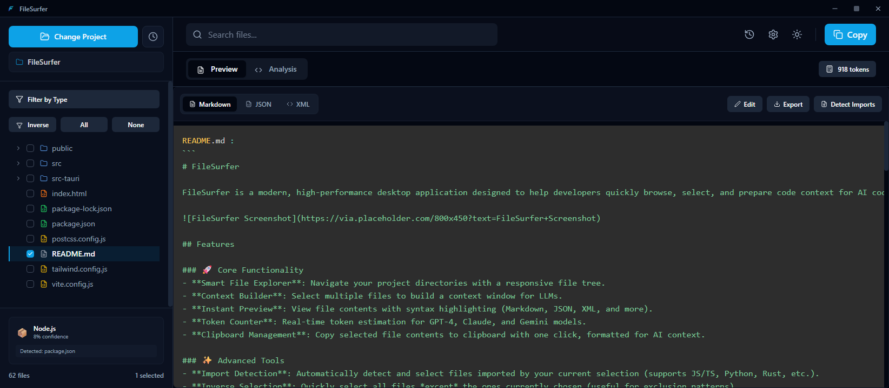

# FileSurfer

FileSurfer is a modern, high-performance desktop application designed to help developers quickly browse, select, and prepare code context for AI coding assistants. Built with Tauri and React, it offers a sleek, frameless UI with powerful features like token estimation, dependency detection, and smart file selection.



## Features

### 🚀 Core Functionality
- **Smart File Explorer**: Navigate your project directories with a responsive file tree.
- **Context Builder**: Select multiple files to build a context window for LLMs.
- **Instant Preview**: View file contents with syntax highlighting (Markdown, JSON, XML, and more).
- **Token Counter**: Real-time token estimation for GPT-4, Claude, and Gemini models.
- **Clipboard Management**: Copy selected file contents to clipboard with one click, formatted for AI context.

### ✨ Advanced Tools
- **Import Detection**: Automatically detect and select files imported by your current selection (supports JS/TS, Python, Rust, etc.).
- **Inverse Selection**: Quickly select all files *except* the ones currently chosen (useful for exclusion patterns).
- **Code Analysis**: Built-in analysis to detect functions, TODOs, and project dependencies.
- **Project Type Detection**: Automatically identifies the project type (Node.js, Rust, Python, etc.).
- **Spotlight Search**: Fast, keyboard-centric file search (`Ctrl+P` / `Cmd+P`).

### 🎨 UI/UX
- **Modern Design**: Clean, dark-themed interface built with Tailwind CSS.
- **Frameless Window**: Custom title bar with integrated window controls for a seamless look.
- **Responsive Layout**: Resizable panels and adaptive design.
- **Themes**: Toggle between Dark and Light modes.

## Tech Stack

- **Frontend**:
  - [React 19](https://react.dev/)
  - [Vite](https://vitejs.dev/)
  - [Tailwind CSS](https://tailwindcss.com/)
  - [Lucide React](https://lucide.dev/) (Icons)
  - [PrismJS](https://prismjs.com/) (Syntax Highlighting)

- **Backend**:
  - [Tauri v2](https://tauri.app/) (Rust)
  - `walkdir` (File system traversal)
  - `regex` (Pattern matching)
  - `arboard` (Clipboard management)

## Getting Started

### Prerequisites
- [Node.js](https://nodejs.org/) (v16 or newer)
- [Rust](https://www.rust-lang.org/tools/install) (latest stable)
- [Tauri Prerequisites](https://tauri.app/v2/guides/getting-started/prerequisites) (OS-specific build tools)

### Installation

1.  **Clone the repository**:
    ```bash
    git clone https://github.com/bipash25/Filesurfer.git
    cd FileSurfer
    ```

2.  **Install frontend dependencies**:
    ```bash
    npm install
    ```

3.  **Run in development mode**:
    ```bash
    npm run tauri dev
    ```

4.  **Build for production**:
    ```bash
    npm run tauri build
    ```
    The executable will be located in `src-tauri/target/release/bundle/`.

## Usage Guide

1.  **Open a Project**: Use the directory picker in the sidebar to select your project folder.
2.  **Browse & Select**: Click files in the tree to select them. Use `Ctrl/Cmd + Click` for multiple selection.
3.  **Preview**: The selected file's content is shown in the main panel.
4.  **Detect Imports**: Click the "Detect Imports" button in the preview panel to automatically select related files.
5.  **Check Tokens**: Click the token counter badge to see detailed estimates for different AI models.
6.  **Copy Context**: Click the "Copy" button in the header to copy all selected files to your clipboard, formatted for pasting into an AI chat.

## Configuration

FileSurfer automatically creates a configuration file to persist your settings:
- **Theme**: Dark/Light mode preference.
- **Recent Paths**: History of opened project directories.
- **Max File Size**: Limit for file preview (default: 10MB).

## Contributing

Contributions are welcome! Please feel free to submit a Pull Request.

1.  Fork the project
2.  Create your feature branch (`git checkout -b feature/AmazingFeature`)
3.  Commit your changes (`git commit -m 'Add some AmazingFeature'`)
4.  Push to the branch (`git push origin feature/AmazingFeature`)
5.  Open a Pull Request

## License

This project is licensed under the MIT License - see the [LICENSE](LICENSE) file for details.
